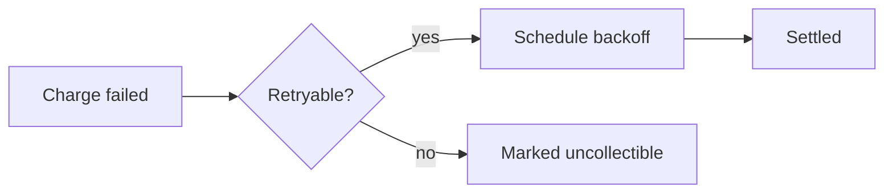

# Laravel AI Docs

[](https://packagist.org/packages/phattarachai/laravel-ai-docs)
[](https://github.com/phattarachai/laravel-ai-docs/actions/workflows/run-tests.yml?query=branch%3Amain)
[](https://github.com/phattarachai/laravel-ai-docs/actions/workflows/fix-php-code-style-issues.yml?query=branch%3Amain)
[](https://packagist.org/packages/phattarachai/laravel-ai-docs)

[](https://packagist.org/packages/phattarachai/laravel-ai-docs)

Render a folder of markdown — your `.ai/documents/` tree, your handbook, your runbooks — as a searchable documentation
site inside your Laravel app, instead of pushing it to a separate wiki that immediately goes stale.

The files stay where they are, next to the code, versioned with it. The panel mounts at `/docs`, behind **your** auth
gate, and reads the directory as it is: folders become sidebar groups and nest as deeply as you nested them,
`# Heading` becomes the nav label, images sitting beside the markdown just work.


<sub>Both screenshots render the fictional documentation tree in [`art/demo-docs/`](art/demo-docs) — no real project or
person appears in them.</sub>

## Requirements — read these first

- **PHP 8.4+, Laravel 11/12/13.**
- **Inertia v2/v3 + React 18/19** in the host app. The panel is an Inertia page, not a Blade view.
- The host app **builds its own assets** — nothing is precompiled or published as a bundle.
- **`mermaid` as an npm dependency.** It is a peer dependency, lazy-imported; without it diagram fences degrade to
  plain text rather than breaking the page.
- **An access gate.** There is no default. Until you register one, every request is refused.

**No Tailwind, and no `@source` line.** Like its sibling `laravel-db-console`, this panel ships plain CSS scoped
under `.doc-root`, imported by the module itself — so it renders correctly in a host with any CSS setup, or none.

Run `php artisan ai-docs:doctor` at any point: it checks the routes, the gate, the docs root, the published page, the
Vite alias and `mermaid`, and tells you which one is missing.

## Install

```bash
composer require phattarachai/laravel-ai-docs
php artisan vendor:publish --tag=ai-docs-config     # optional
php artisan vendor:publish --tag=ai-docs-inertia    # required
npm install mermaid
```

The `ai-docs-inertia` tag is **not** optional: it publishes one file, `resources/js/pages/AiDocs.jsx`, and it has to
live there because `app.jsx`'s `import.meta.glob('./pages/**/*.jsx')` never leaves that directory. The stub is a dozen
lines — a `<Head>` and `<AiDocs {...props} />`. The module itself stays in `vendor/` and is reached through an alias, so
there is no second copy to drift out of sync.

Add that alias in `vite.config.js`:

```js
import path from 'node:path'

export default defineConfig({
    resolve: {
        alias: {
            '@ai-docs': path.resolve(
                __dirname,
                'vendor/phattarachai/laravel-ai-docs/resources/js/ai-docs',
            ),
        },
    },
})
```

Then register the gate, in `AppServiceProvider::boot()`:

```php
use Illuminate\Http\Request;
use Phattarachai\AiDocs\AiDocs;

AiDocs::auth(fn (Request $request): bool => $request->user()?->is_admin === true);
```

Finally, verify and build:

```bash
php artisan ai-docs:doctor
npm run build
```

Open `/docs`.

## Access

The gate is closed by default — with no `AiDocs::auth()` callback registered, the `Authorize` middleware refuses every
request, including yours. That is deliberate: internal docs are usually the most quotable thing in a codebase, and a
package should not guess who may read them.

The middleware is appended by the service provider after `ai-docs.middleware`, so it cannot be dropped by editing that
key. A **guest** who is refused is redirected to `redirect_guests_to` (default: the `login` route) with the intended URL
remembered, so signing in lands them on the page they asked for. A signed-in user the gate rejects gets a plain `403`,
and so does any request expecting JSON.

Kill it entirely with `AI_DOCS_ENABLED=false`: no routes are registered at all, so the paths 404 rather than 403.

## What it does

**The tree is the navigation.** Every `.md` file under `root` is a page; every folder is its own accordion group,
labelled from the directory name (`frontend` → `Frontend`, `ui-kit` → `Ui kit`). Root-level pages sit ungrouped at the
top. There is no sidebar config file to keep in sync — add a file, it appears.

**Panels** — one install can serve several trees. Docs you maintain and task folders you throw away have different
half-lives, and merging them into one root buries the first under the second. Give each its own panel and you get its
own URL, sidebar and search index, plus a switcher in the header:

```php
'panels' => [
    'docs'  => ['root' => '.ai/documents', 'label' => 'Documents'],
    'tasks' => ['root' => '.ai/tasks',     'label' => 'Tasks'],
],
```

Links resolve across panels, so a task can link to a doc and back. Leave `panels` empty for the single tree built from
`path` / `root` / `exclude`.

**Collapsing a column** — the header carries a toggle for each side column: the page tree on the left, the outline on
the right. Collapse either to give a wide table or diagram the whole width; the choice is remembered per browser. The
toggles appear only above the width where that column exists — narrower than that, it is already a drawer.

**Search** — `⌘K` opens a palette over a section-level index built server-side and served from `/docs/_search.json`.
Every heading is its own hit, scored across title, heading and body text, with the matched terms highlighted in a
snippet. Arrows move, Enter jumps straight to the anchor.

**Syntax highlighting is server-side**, via `tempest/highlight` with its CSS theme: the HTML carries `.hl-*` classes,
the colours are CSS custom properties per scheme, and no highlighting JavaScript reaches the browser. It lands in the
render cache with the rest of the page.

**Mermaid diagrams** — a ```` ```mermaid ```` fence becomes a diagram, with `mermaid` lazy-imported on the first page
that has one. Both schemes are themed to match the panel, and a small semantic palette is available to opt into with
`class Node decision` or `Node:::decision` — `decision`, `ok`, `bad`, `actor`.

**GitHub alerts** — `> [!NOTE]`, `> [!TIP]`, `> [!IMPORTANT]`, `> [!WARNING]`, `> [!CAUTION]` render as titled
callouts, with the title translated.

**Images stay private.** An image beside your markdown is rewritten to `/docs/_media/{path}` and streamed through the
same gate, so nothing has to be copied into `public/`. Only real image extensions inside the docs root are served, and
`exclude`d paths are refused.

**Copy the path, not the page.** A button on every page copies its repo-relative path —
`.ai/documents/billing/payment-retries.md` — ready to paste after `@` in Claude Code, Cursor, or whatever is reading
your repo. Every heading also gets a `#`
permalink; clicking it copies the absolute URL rather than navigating.

**Full screen** — tables, diagrams and images each get a zoom button that opens them in an overlay, because a sequence
diagram never fits a documentation column.

**Print / Save as PDF** — a toolbar button prints the current page through the browser, so any reader can save a PDF
with no server-side dependency. A `@media print` sheet drops the top bar, both rails and every control, forces the dark
scheme back to ink-on-paper, and keeps code blocks, tables and diagrams from splitting across a page — and because the
whole document already lives in the DOM, the export is the entire page, mermaid diagrams and all, not just the viewport.

**Layout** — three columns (nav · prose · outline) that collapse into drawers on a phone, a scroll-spy outline, and a
light/dark toggle remembered in `localStorage`. The scheme lives on `.doc-root`, never on `<html>`, so the panel never
fights the host app's own theme state.

**Render cache** — keyed on the file's mtime, the render pipeline's version and the current locale, so it is
self-invalidating. Edit a file and reload; there is nothing to warm at deploy and nothing to clear. Set
`AI_DOCS_CACHE=false` while writing if you prefer.

## Writing docs

Plain markdown works with no front matter at all. When there is none, the nav label is the H1, cut at the first
` — `, ` – `, ` (` or `: ` — so a page titled `# Payment retries — the backoff schedule` lists as
**Payment retries**.

Front matter overrides any of that, and every key is optional:

````markdown
---
title: Payment retries — the backoff schedule
nav: Payment retries
order: 10
---

# Payment retries

> [!IMPORTANT]
> A retry never re-runs the pipeline. It resumes from the stored idempotency record.


````

| Key       | Effect                                                                          |
|-----------|---------------------------------------------------------------------------------|
| `title`   | Page title and browser tab. Defaults to the H1, then the filename                |
| `nav`     | Sidebar label. Defaults to the shortened `title`                                 |
| `order`   | Sort position within its group. Unset sorts as `500`                             |

Within a group, pages sort by `order`, then `index.md` first, then nav label. The landing page is `index.md` at the
root of the docs folder, or the first page of the first group if there is none.

Subfolders nest inside their parent group rather than listing beside it, so `cart/prices/` opens *inside* **Cart**
and the breadcrumb reads `Cart · Prices`. There is no depth limit.

When two docs in one folder shorten to the same label — five pages titled `Admin panel — …` — the panel switches those
docs to the half of the title *after* the cut (*Form conventions*, *Table conventions*) rather than listing the same
word five times. So a collision usually needs no front matter at all; reach for `nav` when you want a label the title
doesn't contain.

Links between docs are rewritten to panel URLs and navigate through Inertia — including anchors. A link to a *folder*
lands on whichever page the sidebar lists first under it, so `[#94](../cycle-2/94-billing/)` works without naming a
file; a folder with no page of its own hands off to the first one below it. A relative link that points outside every
panel's root renders as plain text unless `source_link_base` is set, in which case it becomes a link to your code host.

How to *organize* the folder — flat-first structure, the `index.md` map, the 500-line rule, how `order` and `nav`
interact with the folder grouping — is [`docs/authoring.md`](docs/authoring.md). If an agent writes your docs, those
same conventions ship as a drop-in Claude Code skill in
[`examples/document-skill/`](examples/document-skill/SKILL.md).

## Configuration

See [`config/ai-docs.php`](config/ai-docs.php).

| Key                   | Default          | Env                    | Notes                                       |
|-----------------------|------------------|------------------------|---------------------------------------------|
| `enabled`             | `true`           | `AI_DOCS_ENABLED`      | `false` registers no routes                 |
| `path`                | `docs`           | `AI_DOCS_PATH`         | where it mounts                             |
| `domain`              | `null`           | `AI_DOCS_DOMAIN`       | optional route domain                       |
| `middleware`          | `['web']`        | —                      | `Authorize` is always appended              |
| `redirect_guests_to`  | `login`          | `AI_DOCS_LOGIN_ROUTE`  | route name or URL; `null` 403s guests       |
| `root`                | `.ai/documents`  | `AI_DOCS_ROOT`         | relative to the project root                |
| `exclude`             | `[]`             | —                      | path prefixes, matched by whole segment     |
| `panels`              | `[]`             | —                      | several trees; empty means one              |
| `tables`              | `scroll`         | `AI_DOCS_TABLES`       | `scroll` or `wrap`; styling only            |
| `source_link_base`    | `null`           | `AI_DOCS_SOURCE_BASE`  | code-host base URL for out-of-tree links    |
| `cache`               | `true`           | `AI_DOCS_CACHE`        | render + search cache                       |
| `brand.name`          | `APP_NAME`       | `AI_DOCS_BRAND`        | shown in the header                         |
| `brand.accent`        | `#3b82f6`        | `AI_DOCS_ACCENT`       | injected as `--doc-accent`, no rebuild      |
| `brand.url`           | `/`              | `AI_DOCS_BRAND_URL`    | where the header logo links back to         |
| `brand.logo`          | `null`           | —                      | image URL; falls back to the first letter   |

`exclude` matches whole segments relative to `root`, so `'handbook'` drops the `handbook/` directory while leaving
`handbook.md` servable. Excluded paths are dropped from the tree, the search index, direct URLs and `_media` alike.

A `panels` entry may set `path` (defaults to the key), `root`, `label` and `exclude`; whatever it omits falls back to
the top-level key of the same name. Route names gain the panel key — `route('ai-docs.tasks.index')` — while a single
unnamed panel keeps `route('ai-docs.index')`. Panels are registered longest-path first, so one nested inside another's
prefix (`docs` and `docs/tasks`) still resolves.

Everything else is a CSS custom property you can override:

```css
.doc-root {
    --doc-accent: #16a34a;
    --doc-measure: 80ch;
}
```

## Translations

Every browser string is handed to React as one flat `strings` prop from `trans('ai-docs::ui')`; `en` and `th` ship.
Publish and edit them:

```bash
php artisan vendor:publish --tag=ai-docs-lang
```

The React module carries English defaults for the same keys, so it renders standalone even with no lang files at all.
Adding a locale means adding one directory — no JavaScript changes. Note that `callout.*` and `anchor.label` are
rendered **server-side** into the markdown, which is why the render cache is keyed by locale.

## Contributing

```bash
git clone git@github.com:phattarachai/laravel-ai-docs.git
cd laravel-ai-docs
composer install
composer test
```

The suite runs on `orchestra/testbench` against in-memory SQLite — there is no database work in this package, so
nothing heavier is warranted. PHP is formatted with `vendor/bin/pint`, JavaScript with Prettier (`.prettierrc`:
2-space, single quote, no semicolons).

Read [`docs/internals.md`](docs/internals.md) before changing the pipeline or the React module. Every note in it is a
bug that already happened once, and the code carries no comment explaining it.

## Credits

Built on [`league/commonmark`](https://commonmark.thephpleague.com),
[`tempest/highlight`](https://github.com/tempestphp/highlight) and [Mermaid](https://mermaid.js.org).

## Licence

MIT.
