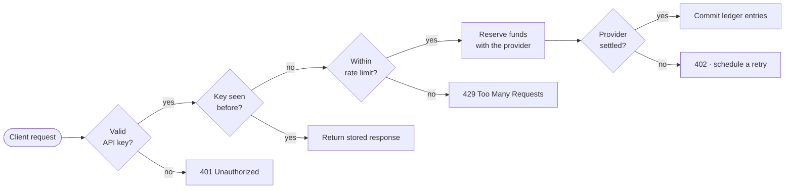

# Request lifecycle

Every write that touches money follows the same path. The shape below is not aspirational — it is what the
middleware stack and the `BillingPipeline` actually do, in order.

## The path a charge takes

## Stage by stage

### Authentication

The key is resolved to an account before anything else runs. A revoked key fails closed — there is no cache window
in which a revoked key still works, because revocation writes a tombstone the resolver checks on every request.

### Idempotency

Any request with a body carries an idempotency key. The first request stores its response body and status against
that key for 24 hours; a repeat returns the stored response byte for byte without re-running the pipeline.

> [!IMPORTANT]
> Reusing a key with a *different* body is a client bug, and Harbor treats it as one: the response is `422`, not a
> silent replay of the original. This is the single most common integration mistake.

### Rate limiting

Limits are per account, not per key, so issuing more keys does not buy more throughput. The window is a sliding
60 seconds evaluated in Redis.

### Validation

Payload validation happens after the cheap rejections so a malformed body from an unauthenticated caller never
reaches the schema layer.

## Where work leaves the request

| Stage | Runs where | Failure mode | Retried |
| --- | --- | --- | --- |
| Authentication | Middleware | `401`, no side effects | No |
| Idempotency lookup | Middleware | Fails open, logs a warning | No |
| Rate limiting | Middleware | `429` with `Retry-After` | By the client |
| Validation | Controller | `422` with a field map | No |
| Fund reservation | Synchronous | `402`, subscription enters grace | Yes, on a schedule |
| Ledger commit | Synchronous, transactional | Rolls back the whole request | No |
| Webhook emission | Queued | Logged, never blocks the response | Yes, eight attempts |

## Transaction boundaries

The ledger commit is the only part of the pipeline inside a database transaction. Provider calls sit outside it
deliberately — holding a transaction open across a network call to a payment provider is how connection pools die.

The consequence is a window where funds are reserved but the ledger is not yet written. The reconciler closes it:
any reservation older than fifteen minutes with no matching ledger entry is released.

> [!WARNING]
> Never add a provider call inside `DB::transaction()`. If you need one, emit an event and let the queue worker
> make the call after commit.
