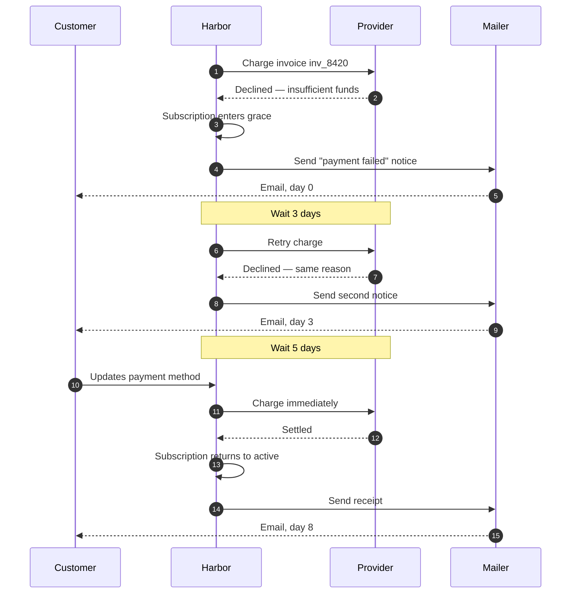

# Payment retries

A declined payment does not cancel anything. It starts a schedule, and the schedule is what the customer
experiences as "grace".

## The retry conversation

## The schedule

| Attempt | Offset from failure | Notice sent | Subscription state |
| --- | --- | --- | --- |
| 1 | Immediate | Yes | `grace` |
| 2 | +3 days | Yes | `grace` |
| 3 | +8 days | Yes | `grace` |
| 4 | +14 days | Final notice | `grace` |
| — | +21 days | Cancellation notice | `cancelled` |

The offsets live on the billing profile. An enterprise account can be given a longer runway without a code change.

## What a card update does

Updating the payment method during grace triggers an immediate charge rather than waiting for the next scheduled
attempt. This is the single highest-recovery behaviour in the system and it must not be made lazy.

### Why not retry on every write

An early version retried on any account activity. It produced duplicate charges when two tabs saved the same form,
so the trigger is now narrowed to a payment-method change and guarded by the idempotency key.

## Giving up

At the end of the schedule the subscription cancels and the invoice moves to `uncollectible`. The invoice is not
voided — the debt is real, it is simply not being pursued automatically.

> [!CAUTION]
> `uncollectible` is not a terminal accounting state for the ledger. The balance stays on the account and still
> appears in receivables reporting until someone writes it off explicitly.
